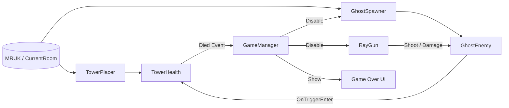

# MR 桌面塔防《Ghost Hunter》（Technical Spike）

## 專案簡介（一句話）
在真實桌面上自動放置高塔，玩家以右手扳機射線槍擊殺桌面生成的 Ghost，避免 Ghost 碰塔扣血直到 Game Over。

---

## 安裝教學（APK / Source）

### A. 安裝 APK（直接玩）
> 適用：你已拿到 `GhostHunter.apk`（或助教提供之 apk）。

1. 開啟 Quest Developer Mode（Meta Quest App → 裝置 → Developer Mode）。
2. 用 USB 將 Quest 連接電腦，戴上頭顯確認「允許 USB 偵錯（USB Debugging）」。
3. 擇一安裝方式：

**方式 1：ADB（推薦）**
```bash
adb devices
adb install -r GhostHunter.apk
```

**方式 2：SideQuest**
- 開啟 SideQuest → 連線成功 → Install APK → 選擇 `GhostHunter.apk`

4. 在 Quest：Library → Unknown Sources → 啟動本遊戲。

---

### B. 編譯 Source（從 Unity 專案建置）
> 適用：你要從本專案原始碼自行 Build。

**可重現環境（以專案檔案為準）**
- Unity：`6000.2.4f1`（`ProjectSettings/ProjectVersion.txt`）
- URP：`com.unity.render-pipelines.universal@17.2.0`（`Packages/manifest.json`）
- Meta XR SDK：`com.meta.xr.sdk.all@81.0.0`（`Packages/manifest.json`）
- XR：OpenXR + XR Management（`com.unity.xr.openxr@1.15.1`、`com.unity.xr.management@4.5.3`）

**Unity Hub 必裝模組**
- Android Build Support（含 OpenJDK / SDK & NDK Tools）

**建置步驟**
1. 用 Unity Hub 開啟專案根目錄（必須包含 `Assets/`、`Packages/`、`ProjectSettings/`）。
2. 開啟場景：`Assets/Scenes/SampleScene.unity`
3. 重要 Layer 設定（驗收關鍵）
   - Layer 3：`Enemy`（Ghost 在此 layer；RayGun 以 layerMask 命中）
   - Layer 6：`Tower`（Tower 在此 layer；RayGun 以 occlusionMask 遮擋）
4. File → Build Settings
   - Platform：Android（Switch Platform）
   - Scenes In Build：加入 `SampleScene`
5. Build And Run（Quest 需 USB 連線並已允許偵錯）

---

## 操作說明（按鍵/手勢圖解）

### 按鍵對應表（Quest 右手控制器）
| 動作 | 裝置/按鍵 | 對應程式（Source of Truth） |
|---|---|---|
| 射擊 | 右手食指扳機（R Index Trigger） | `RayGun.shootingButton = OVRInput.RawButton.RIndexTrigger` |
| 重新開始 | Game Over UI 的 Restart 按鈕 | `GameManager.RestartGame()`（UI Button OnClick 呼叫） |

### 圖解（文字版）
```
Quest 右手控制器（Right Controller）
 ┌─────────────────────────┐
 │  A / B 按鍵（未使用）     │
 │  Thumbstick（未使用）     │
 │                           │
 │  Index Trigger（射擊） ◀──┘
 │  Grip Trigger（未使用）    │
 └─────────────────────────┘
```

---

## 架構圖（系統方塊圖）

### 最小方塊圖（符合評分要求）
`GameManager ↔ GhostSpawner ↔ GhostEnemy`  
並且：`RayGun → GhostEnemy`，`GhostEnemy → TowerHealth → GameManager`

### Mermaid 方塊圖（建議）


---

## 核心玩法（對照期末規格）
1. 怪物會在桌面（水平面）隨機生成  
2. 玩家使用右手射線槍擊殺怪物  
3. 怪物碰到高塔會扣血  
4. 高塔血量歸零即結束（停止生成與射擊、清除場上怪物）

---

## 驗收 Checklist（建議助教逐項勾選）
- [ ] 完成 MR 掃描後，塔會放在「玩家前方桌面」且不會幾秒後漂移到遠處  
- [ ] 桌面持續生成 Ghost（至少 1 隻；同時存在不超過 `maxAlive`）  
- [ ] 扣扳機射擊：命中 Ghost 會扣血並可擊殺  
- [ ] 放任 Ghost 碰塔：塔 HP 下降（Console 可見 `[Tower] HP: ...`）  
- [ ] 塔 HP=0：觸發 Game Over（Spawner/Gun 停用、清場、顯示 Game Over UI）  

---

## 專案結構
- `Assets/`：Unity 資產、場景、腳本、Prefab
- `docs/`：設計文件（SDD）與 Spike 報告
- `Packages/`、`ProjectSettings/`：專案設定（版本與可重現依據）

---

## 文件
- `docs/SDD.md`：Software Design Document（設計與可驗收規格）
- `docs/TechnicalSpike.md`：Technical Spike 報告（技術點、步驟、量測、限制）
