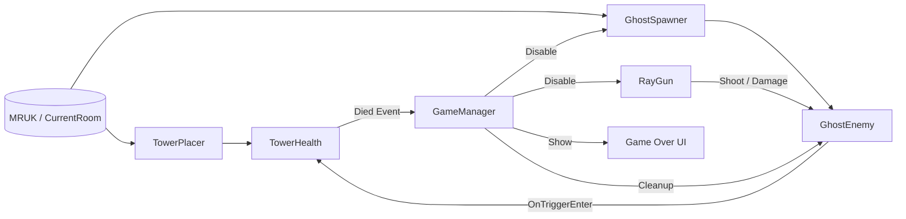

# docs/SDD.md — MR 桌面塔防《Ghost Hunter》Software Design Document（Spike）

> 文件目的：把 Spike 的「需求、設計、驗收口徑」寫成可被他人重現與審查的規格文件。  
> 文件屬性：Technical Spike（非完整遊戲 SDD）。  
> Source of Truth：所有版本與序列化參數以本 Unity 專案檔案為準。

---

## 文件控制（Document Control）
- 版本：v1.0（Spike）
- 維護者：____________
- 最後更新：____________
- 變更摘要：____________

---

## 1. 目標與範圍（Goals & Scope）
本專案為 Meta Quest MR（混合實境）上的桌面塔防遊戲之 **Technical Spike**。本次交付不追求完整關卡、美術與完整 UI/UX，而是以「可重現、可驗收」為目標，驗證以下核心能力可在裝置上穩定運行：

- MR 場景理解：取得房間與水平面（桌面/地板）資訊（MRUK）
- 桌面放置：高塔放在玩家前方桌面，且不因初始化漂移而跑遠
- 射線射擊：右手扳機射擊命中穩定，能對敵人造成傷害並擊殺
- 塔防規則：怪物接觸高塔扣血；塔血量歸零觸發 Game Over（停用生成與射擊、清場、顯示 UI）

**Non‑goals（本 Spike 不做）**
- 完整美術/音效/關卡內容與完整 UI/UX
- 雲端資料上傳、帳號系統、排行榜
- 高階 MR 互動（手勢/抓取/場景道具等）

---

## 2. 可重現環境（Reproducibility / Source of Truth）
以下皆由專案檔案定義（非口述）：

- Unity：`6000.2.4f1`（`ProjectSettings/ProjectVersion.txt`）
- URP：`com.unity.render-pipelines.universal@17.2.0`（`Packages/manifest.json`）
- Meta XR SDK：`com.meta.xr.sdk.all@81.0.0`（`Packages/manifest.json`）
- MRUK：`com.meta.xr.mrutilitykit@81.0.0`（`Packages/packages-lock.json`）
- XR：OpenXR + XR Management（`com.unity.xr.openxr@1.15.1`、`com.unity.xr.management@4.5.3`）
- Build Scene：`Assets/Scenes/SampleScene.unity`

請補齊（供他人重現）：
- 測試裝置：Quest __（2/3/Pro）
- OS / Runtime：__________
- 測試環境：桌面材質/光線/空間大小（2–3 句即可）

---

## 3. 需求（Requirements）

### 3.1 Functional Requirements（FR）
- **FR1 — 敵人生成**：敵人（Ghost）可在 MR 水平面上持續生成，並受同時存在上限控制。
- **FR2 — 射擊與傷害**：玩家以右手扳機射線槍射擊敵人，命中可造成傷害並擊殺。
- **FR3 — 扣塔血量**：敵人接觸高塔時，造成塔扣血。
- **FR4 — Game Over 收斂**：塔 HP 由 >0 變 0 時觸發 Game Over；停止生成與射擊、清除場上敵人，並顯示 Game Over UI。

### 3.2 Non‑functional Requirements（NFR）
- **NFR1 — 可重現性**：相同裝置與相近環境下，放置與生成成功率需可重現（允許 warmup/retry 與 label 容錯）。
- **NFR2 — 可驗收性**：提供明確驗收腳本（Checklist）與可觀察訊號（Console Log / UI）。
- **NFR3 — 安全收斂**：Game Over 後不得持續生成或接受射擊輸入，避免狀態發散。
- **NFR4 — 可維護性（Spike 底線）**：核心互動（傷害、生成、狀態機）不得依賴不透明 workaround；若期程需採 workaround，必須在「已知技術債」註明並提供替代設計。

---

## 4. 系統架構（Architecture）

### 4.1 最小方塊關係（評分/驗收對齊）
`GameManager ↔ GhostSpawner ↔ GhostEnemy`  
並且：`RayGun → GhostEnemy`，`GhostEnemy → TowerHealth → GameManager`

### 4.2 Mermaid 架構圖

---

## 5. 模組責任與介面（Modules & Responsibilities）

### 5.1 GameManager
- 職責：訂閱 `TowerHealth.Died`；Game Over 時停用 Spawner 與 RayGun、清場、顯示 UI；提供 `RestartGame()`。
- 設計要點：Game Over handler 必須一次性（避免重入與多次清場）。

### 5.2 TowerHealth
- 職責：維護塔 HP；提供 `TakeDamage(int)`；HP 歸零觸發 `Died` 事件。
- 可觀察訊號：Console log（例如 `[Tower] HP: ...`）與 UI 血條（若有）。

### 5.3 TowerPlacer
- 職責：等待 MRUK 就緒後，在指定 label 的 surface 上挑選「玩家前方」點位放置塔；支援 warmup 與 retry 以降低初始化漂移。
- 關鍵策略：warmup、取樣與評分函數（前方 dot、距離、離邊距）。

### 5.4 GhostSpawner（檔名 `GhostSpawer.cs`，類別 `GhostSpawner`）
- 職責：按時間間隔取樣 MR surface 生成 Ghost；限制同時存在數；提供失敗容錯（label 不穩、取樣失敗）。
- 技術債註記：建議將檔名更名為 `GhostSpawner.cs`（檔名與類別一致）。

### 5.5 GhostEnemy
- 職責：朝塔移動；碰到塔觸發扣血並自毀；提供 `TakeDamage(int)` 供射擊互動。

### 5.6 RayGun
- 職責：右手扳機射擊；使用 overlap + spherecast 提升命中穩定；命中後呼叫敵人傷害介面；顯示光束。
- 遮擋：`occlusionMask` 用於避免射線穿過 Tower（或其他遮擋物）。
- 技術債註記（重要）：目前為相容性使用反射尋找 `TakeDamage` 或 HP 欄位。Spike 後建議改為明確介面（例如 `IDamageable`）並移除反射。

---

## 6. 關鍵流程（Event Flow）

### 6.1 初始化與放置
1. 等待 `MRUK.Instance.IsInitialized` 且 `CurrentRoom != null`
2. warmup（等待 tracking/room lock 穩定）
3. 多次取樣候選點並挑選最佳（玩家前方、距離合理、離邊距足夠）
4. 放置 Tower，進入 Running

### 6.2 生成與戰鬥
1. `GhostSpawner` 以固定間隔嘗試生成
2. `GhostEnemy` 朝 Tower 移動
3. 玩家扳機射擊命中 → `GhostEnemy.TakeDamage`
4. `GhostEnemy` 觸塔 → `TowerHealth.TakeDamage`

### 6.3 Game Over 收斂
1. `TowerHealth` HP=0 觸發 `Died`
2. `GameManager`：
   - Disable `GhostSpawner`
   - Disable `RayGun`
   - 清除場上 Ghost
   - 顯示 Game Over UI

---

## 7. 場景與序列化參數（以 SampleScene 序列化為準）
主場景：`Assets/Scenes/SampleScene.unity`

> 這一章的目的，是讓驗收者能「在 Inspector 逐項對照」：文件的數值必須跟 scene 序列化一致。

### 7.1 TowerPlacer（放置穩定）
- `warmupSeconds = 1.5`
- `autoRetries = 20`
- `retryInterval = 0.25`
- `attempts = 800`
- `targetLabels = TABLE | OTHER`（Scene bitmask：`136`）

### 7.2 GhostSpawner（生成穩定）
- `spawnTimer = 1`
- `attemptsPerSpawn = 32`
- `maxAlive = 25`
- `lifeTime = 0`

> 註：`lifeTime = 0` 代表不做自動淘汰。若你們觀察到「敵人累積導致掉幀」或「maxAlive 上限仍造成壓力」，建議把 lifeTime 調回非 0（例如 10–20 秒）或導入 object pooling。

- `spawnLabels = TABLE | OTHER`（Scene bitmask：`136`）

### 7.3 RayGun（命中穩定）
- `beamRadius = 0.03`
- `closeRangeOverlapRadius = 0.05`
- `maxLineDistance = 5`
- `piercing = 1`
- `damagePerShot = 1`
- `layerMask = Enemy`（bits=`8`）
- `occlusionMask = Tower`（bits=`64`）

### 7.4 GameManager（重啟 UX）
- `holdToRestartSeconds = 0.25`（若誤觸頻繁，建議提高到 ≥ 1.0 秒）

---

## 8. 風險、失敗模式與緩解（Risk & Mitigation）

| 風險/失敗模式 | 現象 | 緩解策略（本專案） |
|---|---|---|
| MR 初期漂移 | 塔一開始放對，幾秒後跑遠 | `TowerPlacer` warmup + retry；限制在玩家前方與距離上限 |
| 桌面 label 不穩 | 無法在 TABLE 上取樣 | 使用 `TABLE | OTHER` 容錯；必要時提供 fallback（需明確定義） |
| 射線命中不穩 | 近距離 miss、穿模 | overlap + spherecast；調 `beamRadius`、`closeRangeOverlapRadius` |
| Trigger 不觸發 | 怪碰塔不扣血 | collider/rigidbody 設定正確；OnTriggerEnter 路徑以 log 驗證 |
| 效能發散 | 敵人累積造成掉幀 | `maxAlive` 上限；建議設定非 0 `lifeTime` 或 object pooling；Game Over 清場 |

---

## 9. 驗收（Acceptance Criteria）
- 放置：完成 MR 掃描後，塔在玩家前方桌面，且 5–10 秒內不漂移到遠處
- 生成：桌面持續生成 Ghost；同時存在不超過 `maxAlive`
- 射擊：右手扳機射擊能穩定命中並造成傷害/擊殺（近距離不易 miss）
- 塔防：Ghost 觸塔會扣血；血條或 log 有可觀察變化
- 收斂：塔 HP=0 後，Spawner/Gun 停用、清場、顯示 Game Over UI

---

## 10. 效度威脅（Threats to Validity）
> Spike 的「可重現」最常死在環境變因。請在報告或 demo 前，明確說明這些條件。

- 光線與反光（玻璃桌、強背光）會降低桌面表面辨識與 label 穩定性
- 桌面邊界/大小會影響取樣成功率與放置評分
- Room Capture 完整度與追蹤穩定度（啟動後前 5–15 秒）會影響漂移
- 不同裝置（Quest 2/3/Pro）與 OS 版本可能改變掃描與 tracking 行為

---

## 11. 已知限制與後續工作（Limitations & Next Steps）
- UI/UX：分數、波次、掃描狀態提示、Restart UX
- 難度設計：波次曲線、生成點避障、速度/血量成長
- 量測自動化：放置/生成/命中率的統計記錄與輸出（CSV/JSON）
- 視覺一致性：Passthrough 下材質/深度策略一致化
- 技術債清理：RayGun 反射改介面、GhostSpawner 檔名一致化、大檔素材移出 Unity 專案

