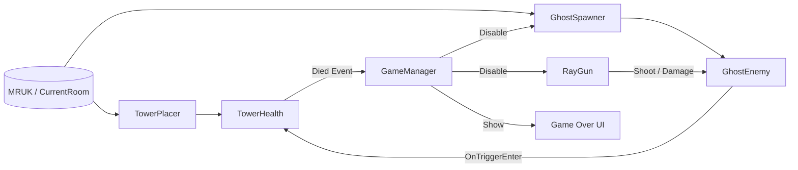

# docs/SDD.md — MR 桌面塔防《Ghost Hunter》Software Design Document

## 1. 目標與範圍
本專案為 Meta Quest MR（混合實境）上的桌面塔防遊戲之 **Technical Spike**。本次交付不追求完整關卡、美術與完整 UI/UX，而是以「可重現、可驗收」為目標，驗證以下核心能力可在裝置上穩定運行：

- MR 場景理解：取得房間與水平面（桌面/地板）資訊
- 桌面放置：高塔能放在玩家前方桌面，且不因初始化漂移而跑遠
- 射線射擊：右手扳機射擊命中穩定，能對敵人造成傷害並擊殺
- 塔防規則：怪物接觸高塔扣血；塔血量歸零觸發 Game Over（停用生成與射擊、清場、顯示 UI）

---

## 2. 可重現環境（Source of Truth）
以下皆由專案檔案定義（非口述）：

- Unity：`6000.2.4f1`（`ProjectSettings/ProjectVersion.txt`）
- URP：`com.unity.render-pipelines.universal@17.2.0`（`Packages/manifest.json`）
- Meta XR SDK：`com.meta.xr.sdk.all@81.0.0`（`Packages/manifest.json`）
- XR：OpenXR + XR Management（`com.unity.xr.openxr@1.15.1`、`com.unity.xr.management@4.5.3`）
- Build Scene：`Assets/Scenes/SampleScene.unity`

---

## 3. 需求（Requirements）

### 3.1 Functional Requirements（FR）
- **FR1 — 敵人生成**：敵人（Ghost）可在 MR 水平面上持續生成，並受同時存在上限控制。
- **FR2 — 射擊與傷害**：玩家以右手扳機射線槍射擊敵人，命中可造成傷害並擊殺。
- **FR3 — 扣塔血量**：敵人接觸高塔時，造成塔扣血。
- **FR4 — Game Over 收斂**：塔 HP 由 >0 變 0 時觸發 Game Over；停止生成與射擊、清除場上敵人，並顯示 Game Over UI。

### 3.2 Non‑functional Requirements（NFR）
- **NFR1 — 可重現性**：同一裝置與相近環境下，放置與生成成功率需可重現（允許 warmup/retry 與 label 容錯）。
- **NFR2 — 可驗收性**：提供明確驗收腳本（Checklist）與可觀察訊號（Console Log / UI）。
- **NFR3 — 安全收斂**：Game Over 後不得持續生成或接受射擊輸入，避免狀態發散。

---

## 4. 系統架構（Architecture）

### 4.1 最小方塊關係（對照 README 評分要求）
`GameManager ↔ GhostSpawner ↔ GhostEnemy`  
並且：`RayGun → GhostEnemy`，`GhostEnemy → TowerHealth → GameManager`

### 4.2 Mermaid 架構圖（建議）

---

## 5. 模組責任與介面（Modules & Responsibilities）
> 以「單一責任」與「可測試性」為原則。

### 5.1 GameManager
- 職責：訂閱 `TowerHealth.Died`；Game Over 時停用 Spawner 與 RayGun、清場、顯示 UI；提供 `RestartGame()` 供 UI 觸發重開。
- 關鍵介面：
  - `RestartGame()`：重新載入目前 Scene
  - `OnTowerDied()`：一次性處理（避免重入）

### 5.2 TowerHealth
- 職責：維護塔 HP；提供 `TakeDamage(int)`；HP 歸零觸發 `Died` 事件。
- 可觀察訊號：Console log `[Tower] HP: ...`、`[Tower] Game Over`

### 5.3 TowerPlacer
- 職責：等待 MRUK 就緒後，在指定 label 的 surface 上挑選「玩家前方」點位放置塔；支援 warmup 與 retry 以減少初始化漂移。
- 關鍵策略：
  - Warmup：等待 tracking / room lock 穩定
  - Constraints：距離相機、前方 dot、離邊距、偏好水平距離

### 5.4 GhostSpawner（檔名 `GhostSpawer.cs`，類別 `GhostSpawner`）
- 職責：按時間間隔取樣 MR surface 生成 Ghost；限制同時存在數；可選擇將材質設為透明且關閉深度寫入以提升 Passthrough 可讀性；提供失敗容錯（sanitize / fallback）。
- 關鍵策略：
  - Label bitmask：可用 `TABLE | OTHER` 提升桌面標記不穩時的成功率
  - `maxAlive`：控制效能上限
  - `lifeTime`：避免無限累積

### 5.5 GhostEnemy
- 職責：朝塔移動；碰到塔觸發扣血並自毀；與 `RayGun` 交互承擔受擊/死亡。
- 關鍵事件：`OnTriggerEnter(Tower)` → `TowerHealth.TakeDamage(...)`

### 5.6 RayGun
- 職責：以右手扳機輸入（`OVRInput.RawButton.RIndexTrigger`）射線射擊；使用 spherecast/overlap 提升命中穩定；命中敵人後呼叫其傷害介面；LineRenderer 顯示光束。
- 遮擋：`occlusionMask` 用於避免射線穿過 Tower（或其他遮擋物）

---

## 6. 關鍵流程（Data / Event Flow）

### 6.1 初始化與放置流程
1. `TowerPlacer.Start()` 等待 `MRUK.Instance.IsInitialized` 且 `CurrentRoom != null`
2. Warmup（`warmupSeconds`）
3. 以 `GenerateRandomPositionOnSurface(FACING_UP, ...)` 取樣點位
4. 以 constraints 篩選點位，成功則放置塔（必要時 retry）

### 6.2 生成流程
1. `GhostSpawner` 計時到 `spawnTimer`
2. 取樣 surface 點位 → instantiate Ghost
3. Ghost 設定 `tower` 參考，開始追塔
4. 若超過 `maxAlive`，淘汰最舊或逾時物件

### 6.3 射擊流程
1. 玩家扣右手扳機 → `RayGun` 觸發射擊
2. RayGun 以 layerMask（Enemy）進行 spherecast / overlap
3. 命中 `GhostEnemy` → `TakeDamage(...)` 或等效傷害介面
4. Ghost HP=0 → Destroy；同時更新 UI/feedback（若有）

### 6.4 扣血與 Game Over 流程
1. `GhostEnemy.OnTriggerEnter` 碰到 Tower collider
2. 呼叫 `TowerHealth.TakeDamage(damage)`
3. `TowerHealth` HP 歸零 → 觸發 `Died` event
4. `GameManager` 收斂：停用 `GhostSpawner`/`RayGun`、清場、顯示 Game Over UI

---

## 7. 參數（以 SampleScene 序列化設定為準）
> 目的：讓驗收者在 Inspector 可直接對照，避免文件與實作不一致。

### 7.1 TowerPlacer（放置穩定）
- `warmupSeconds = 1.5`
- `autoRetries = 20`
- `retryInterval = 0.25`
- `attempts = 800`
- `targetLabels = TABLE | OTHER`（Scene 序列化 bitmask：`136`）

### 7.2 GhostSpawner（生成穩定）
- `spawnTimer = 1`
- `attemptsPerSpawn = 32`
- `maxAlive = 25`
- `lifeTime = 12`
- `spawnLabels = TABLE | OTHER`（Scene 序列化 bitmask：`136`）

### 7.3 RayGun（命中穩定）
- `beamRadius = 0.03`
- `closeRangeOverlapRadius = 0.05`
- `maxLineDistance = 5`
- `piercing = 1`
- `damagePerShot = 1`
- `layerMask = Enemy`（Layer 3，bit：`1<<3 = 8`）
- `occlusionMask = Tower`（Layer 6，bit：`1<<6 = 64`）

---

## 8. 風險、失敗模式與緩解（Risk & Mitigation）

| 風險/失敗模式 | 現象 | 緩解策略（本專案） |
|---|---|---|
| MR 初期漂移 | 塔一開始放對，幾秒後跑遠 | `TowerPlacer` warmup + retry；限制在玩家前方與距離上限 |
| 桌面 label 不穩 | 無法在 TABLE 上取樣 | 使用 `TABLE | OTHER` 的 label 容錯；必要時提供 fallback |
| 射線命中不穩 | 近距離 miss、穿模 | `RayGun` 使用 overlap + spherecast；可調 `beamRadius` 與 `closeRangeOverlapRadius` |
| Trigger 不觸發 | 怪碰塔不扣血 | 物件 collider/rigidbody 設定正確；OnTriggerEnter 路徑可由 log 驗證 |
| 效能發散 | 敵人累積造成掉幀 | `maxAlive` 上限 + `lifeTime` 淘汰；Game Over 清場 |

---

## 9. 測試計畫（驗收腳本）
> 詳細 checklist 以 README 為準；此處列 SDD 驗收點與判準。

1. **放置**：完成 MR 掃描後，塔在玩家前方桌面且不漂移至遠處（約數秒觀察）。
2. **生成**：桌面持續生成 Ghost，至少可觀察到 1 隻；同時存在不超過 `maxAlive`。
3. **射擊**：扣右手扳機，命中 Ghost 可扣血並擊殺。
4. **扣血**：放任 Ghost 觸塔，Console 出現 `[Tower] HP: ...` 且數值下降。
5. **Game Over**：HP=0 時顯示 Game Over UI；Spawner/Gun 停用；場上 Ghost 清除。

---

## 10. 已知限制與後續工作（Limitations & Next Steps）
- 完整 UI/UX：分數、波次、提示、掃描狀態、可視化桌面區域
- 難度設計：波次曲線、生成點避障、速度/血量成長
- 量測自動化：放置/生成/命中率的統計記錄與輸出
- 視覺一致性：Passthrough 下材質/深度策略優化

---

## 11. 交付物（Deliverables）
- Unity 專案（本 Repo）
- 文件：`README.md`、`docs/SDD.md`、`docs/TechnicalSpike.md`
-（建議）實機證據：`docs/media/*.mp4`（放置/生成/射擊/Game Over 各一段）
